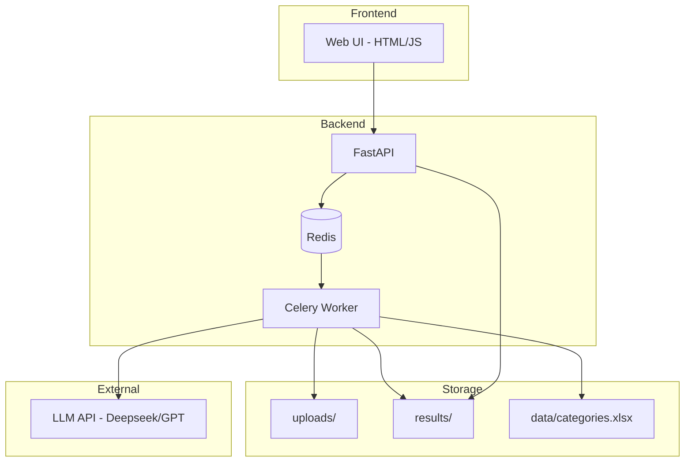

# Design Document

## Overview

Сервис для автоматической обработки Excel-файлов с комментариями о дефектах. Архитектура построена на FastAPI для API, Celery/Redis для фоновой обработки, openpyxl для работы с Excel, rapidfuzz для поиска категорий и LLM (Deepseek/GPT) для разделения и классификации.

Основной поток:
1. Пользователь загружает .xlsx файл через веб-интерфейс или API
2. Система создаёт задачу в очереди
3. Worker читает файл, разделяет комментарии на дефекты (LLM)
4. Worker классифицирует каждый дефект по справочнику категорий (LLM)
5. Система формирует результирующий файл и отдаёт пользователю

## Architecture



### Компоненты системы

1. **Web UI** — простая HTML-страница с формой загрузки и отображением статуса
2. **FastAPI Backend** — REST API для загрузки файлов, статуса и скачивания
3. **Redis** — брокер сообщений для очереди задач
4. **Celery Worker** — фоновая обработка файлов
5. **LLM Client** — клиент для работы с Deepseek/GPT API

## Components and Interfaces

### API Endpoints

```python
# POST /jobs - загрузка файла
@app.post("/jobs")
async def create_job(file: UploadFile) -> JobResponse:
    """
    Принимает .xlsx файл, сохраняет, создаёт задачу.
    Returns: { job_id: str }
    """

# GET /jobs/{job_id} - статус задачи
@app.get("/jobs/{job_id}")
async def get_job_status(job_id: str) -> JobStatusResponse:
    """
    Returns: { status: str, progress: int, download_url: str | None }
    """

# GET /jobs/{job_id}/download - скачивание результата
@app.get("/jobs/{job_id}/download")
async def download_result(job_id: str) -> FileResponse:
    """
    Отдаёт обработанный файл.
    """
```

### Core Services

```python
class ExcelReader:
    """Чтение и парсинг Excel файлов"""
    
    def read_file(self, file_path: str) -> list[dict]:
        """Читает xlsx, возвращает список строк как словари"""
        
    def find_comment_column(self, sheet) -> int:
        """Находит столбец КОММЕНТАРИЙ по названию"""


class SplitService:
    """Разделение комментариев на дефекты через LLM"""
    
    def __init__(self, llm_client: LLMClient, cache: Cache):
        pass
    
    def split_comment(self, comment: str) -> list[str]:
        """Разделяет один комментарий на список дефектов"""
        
    def split_batch(self, comments: list[str]) -> list[list[str]]:
        """Батчевая обработка комментариев (20-50 штук)"""


class CategoryIndex:
    """Индекс категорий для быстрого поиска"""
    
    def __init__(self, categories_path: str):
        pass
    
    def load_categories(self) -> list[str]:
        """Загружает категории из файла"""
        
    def build_index(self):
        """Строит fuzzy-индекс для поиска"""
        
    def find_top_n(self, text: str, n: int = 10) -> list[str]:
        """Находит N наиболее похожих категорий"""
        
    def check_and_rebuild(self):
        """Проверяет изменения файла и пересобирает индекс"""


class ClassifyService:
    """Классификация дефектов по категориям через LLM"""
    
    def __init__(self, llm_client: LLMClient, category_index: CategoryIndex, cache: Cache):
        pass
    
    def classify_defect(self, defect: str, candidates: list[str]) -> str:
        """Классифицирует один дефект, возвращает категорию"""
        
    def classify_batch(self, defects: list[str]) -> list[str]:
        """Батчевая классификация (50 штук)"""


class ExcelWriter:
    """Формирование результирующего Excel файла"""
    
    def write_result(self, rows: list[dict], output_path: str):
        """Записывает результат в xlsx файл"""
```

### LLM Client

```python
class LLMClient:
    """Клиент для работы с LLM API"""
    
    def __init__(self, api_key: str, model: str = "deepseek-chat"):
        pass
    
    async def split_comments(self, comments: list[str]) -> list[dict]:
        """
        Prompt: Разделить комментарии на отдельные дефекты.
        Response: {"results": [{"defects": [{"text": "..."}]}]}
        """
        
    async def classify_defects(self, defects_with_candidates: list[dict]) -> list[str]:
        """
        Prompt: Выбрать категорию для каждого дефекта из списка кандидатов.
        Response: {"results": [{"chosen": "категория"}]}
        """
```

### Worker Task

```python
@celery.task
def process_job(job_id: str, file_path: str):
    """
    Основная задача обработки файла:
    1. Читает xlsx
    2. Разделяет комментарии (split)
    3. Размножает строки (expand)
    4. Классифицирует дефекты
    5. Записывает результат
    """
```

## Data Models

```python
from pydantic import BaseModel
from enum import Enum

class JobStatus(str, Enum):
    PENDING = "pending"
    SPLITTING = "splitting"
    CLASSIFYING = "classifying"
    COMPLETED = "completed"
    FAILED = "failed"

class Job(BaseModel):
    id: str
    status: JobStatus
    progress: int  # 0-100
    input_file: str
    output_file: str | None
    error: str | None
    created_at: datetime
    updated_at: datetime

class JobResponse(BaseModel):
    job_id: str

class JobStatusResponse(BaseModel):
    status: JobStatus
    progress: int
    download_url: str | None
    error: str | None

class SplitResult(BaseModel):
    defects: list[dict]  # [{"text": "..."}]

class ClassifyResult(BaseModel):
    chosen: str  # название категории

class ExpandedRow(BaseModel):
    """Строка после размножения"""
    original_data: dict  # все исходные столбцы
    defect_text: str
    category: str | None
```

### Структура файлов

```
project/
├── app/
│   ├── __init__.py
│   ├── main.py              # FastAPI app
│   ├── api/
│   │   ├── __init__.py
│   │   └── jobs.py          # API endpoints
│   ├── services/
│   │   ├── __init__.py
│   │   ├── excel_reader.py
│   │   ├── excel_writer.py
│   │   ├── split_service.py
│   │   ├── classify_service.py
│   │   ├── category_index.py
│   │   └── llm_client.py
│   ├── models/
│   │   ├── __init__.py
│   │   └── schemas.py
│   ├── worker/
│   │   ├── __init__.py
│   │   └── tasks.py
│   └── config.py
├── data/
│   └── categories.xlsx
├── uploads/
├── results/
├── static/
│   └── index.html
├── tests/
├── requirements.txt
└── docker-compose.yml
```


## Correctness Properties

*A property is a characteristic or behavior that should hold true across all valid executions of a system—essentially, a formal statement about what the system should do. Properties serve as the bridge between human-readable specifications and machine-verifiable correctness guarantees.*

### Property 1: File Format Validation

*For any* uploaded file, the system should accept it if and only if it has .xlsx extension.

**Validates: Requirements 1.1**

### Property 2: Job ID Uniqueness

*For any* two file uploads, the returned job_id values should be different.

**Validates: Requirements 1.2**

### Property 3: File Persistence Round-Trip

*For any* successfully uploaded file, reading the file from uploads/{job_id}.xlsx should return content identical to the original.

**Validates: Requirements 1.3**

### Property 4: Comment Column Detection

*For any* Excel file containing a column named "КОММЕНТАРИЙ", the ExcelReader should successfully find and return its index.

**Validates: Requirements 2.2**

### Property 5: Row Extraction Completeness

*For any* Excel file with N data rows, the ExcelReader should extract exactly N rows.

**Validates: Requirements 2.3**

### Property 6: Empty Comment Handling

*For any* comment that is empty, whitespace-only, or contains "нет замечаний", the SplitService should return an empty list of defects.

**Validates: Requirements 3.1**

### Property 7: Split Response Parsing Round-Trip

*For any* valid SplitResult object, serializing to JSON and parsing back should produce an equivalent object.

**Validates: Requirements 3.3**

### Property 8: Split Caching Idempotence

*For any* comment, calling split_comment twice with the same input should return identical results.

**Validates: Requirements 3.5**

### Property 9: Row Expansion Count

*For any* row with a comment that splits into N defects, the expand operation should produce exactly N output rows.

**Validates: Requirements 4.1, 4.4**

### Property 10: Column Preservation Invariant

*For any* expanded row, all original columns (except "КОММЕНТАРИЙ") should have the same values as the source row, and "КОММЕНТАРИЙ" should contain the defect text.

**Validates: Requirements 4.2, 4.3, 7.2**

### Property 11: Category Search Result Count

*For any* defect text, the CategoryIndex.find_top_n(text, N) should return exactly N categories (or all categories if fewer than N exist).

**Validates: Requirements 5.2, 6.1**

### Property 12: Classify Response Parsing Round-Trip

*For any* valid ClassifyResult object, serializing to JSON and parsing back should produce an equivalent object.

**Validates: Requirements 6.3**

### Property 13: Category Assignment Completeness

*For any* classified row, the "Категория дефекта" column should contain a non-empty string from the category reference.

**Validates: Requirements 6.4**

### Property 14: Classify Caching Idempotence

*For any* defect text, calling classify_defect twice with the same input should return identical category.

**Validates: Requirements 6.6**

### Property 15: Output File Path Convention

*For any* completed job, the output file should exist at results/{job_id}_processed.xlsx.

**Validates: Requirements 7.3**

### Property 16: Status Update on Completion

*For any* job where the output file is successfully written, the job status should be "completed".

**Validates: Requirements 7.4**

### Property 17: Status Response Completeness

*For any* existing job_id, the status response should contain status, progress, and download_url fields.

**Validates: Requirements 8.1**

### Property 18: Download URL Availability

*For any* job with status "completed", the download_url should not be None.

**Validates: Requirements 8.2**

### Property 19: Download Round-Trip

*For any* completed job, downloading the file via API should return a valid xlsx file with the expected structure.

**Validates: Requirements 8.3**

## Error Handling

### API Errors

| Error | HTTP Code | Response |
|-------|-----------|----------|
| Invalid file format | 400 | `{"error": "Only .xlsx files are accepted"}` |
| File too large | 413 | `{"error": "File size exceeds limit"}` |
| Job not found | 404 | `{"error": "Job not found"}` |
| Job not completed | 400 | `{"error": "Job is not completed yet"}` |

### Worker Errors

| Error | Handling |
|-------|----------|
| Column "КОММЕНТАРИЙ" not found | Set job status to "failed", store error message |
| LLM API error | Retry 3 times with exponential backoff, then fail |
| Invalid LLM response | Log error, skip row, continue processing |
| File write error | Set job status to "failed", store error message |

### Recovery Strategy

- Все промежуточные результаты сохраняются в Redis
- При перезапуске worker может продолжить с последней точки
- Файлы в uploads/ и results/ очищаются по расписанию (24 часа)

## Testing Strategy

### Unit Tests

- ExcelReader: чтение файлов, поиск столбцов, извлечение данных
- SplitService: парсинг JSON, обработка пустых комментариев
- ClassifyService: парсинг JSON, работа с кандидатами
- CategoryIndex: загрузка категорий, fuzzy-поиск
- ExcelWriter: запись файлов, формирование структуры

### Property-Based Tests

Используем **pytest** с библиотекой **hypothesis** для property-based testing.

Каждый property-тест должен:
- Запускаться минимум 100 итераций
- Быть аннотирован ссылкой на свойство из дизайна
- Генерировать разнообразные входные данные

Примеры генераторов:
- Excel файлы с разным количеством строк и столбцов
- Комментарии разной длины и содержания
- JSON ответы LLM с разным количеством дефектов

### Integration Tests

- Полный цикл: загрузка → обработка → скачивание
- Работа с реальным Redis и Celery
- Mock LLM API для предсказуемых результатов

### Test Configuration

```python
# pytest.ini
[pytest]
testpaths = tests
python_files = test_*.py
python_functions = test_*
addopts = -v --hypothesis-show-statistics
```
